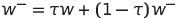

# Implementation details
In order to implement the DDPG strategy, we developed the following classes:
* **Agent**: It is responsible of processing the environment experiences, define the background neural networks and 
 carries out the learning process.
* **ReplayBuffer**: It is the storage used for saving and sampling the experiences collected from the environment.
* **OUNoise**: This class implements an Ornstein-Uhlenbeck process. This process is used to add noise to the output of 
the actor network. This mechanismus is used to enable space exploration for gaining new knowledge and avoid 
 over-explotation of the current knowledge.  
* **Actor**: This class implements the neural network used as actor, i.e. the neural network that decides, given a 
state, which is next action to follow.
* **Critic**: It describes the neural network used as critic. The critic delivers the value of a given state-action 
pair.

  
The **Agent** is the orchestrator of the learning process. It defines four neural networks:
* **actor_local**: It corresponds to the actor neural network that, after the training is finished, will be used for 
prediction. Given a state, this networks returns the action to be performed.
* **actor_target**: This neural network has the same structure as actor_local and is used to implement the fixed target 
strategy, which increases the stability of the learning process. Thus, it represents a time-delayed copy of actor_local. 
* **critic_local**: It corresponds to the critic neural network that, once the training is finished, will be used for
 prediction. Given a state and an action, this neural network returns an estimation of the value of the Q(s, a) function. 
* **critic_target**: Similarly to actor_target, this network represents a time-delayed copy of critic_local and is 
needed for implementing the fixed target strategy.

During training, we used two loss functions:
* The critic network uses the mean squared error as loss function. Thus, it is intended that this networks learns to 
estimates accurated values of the Q(s, a) function. The target values when computing the loss functions are calculated
with the Bellman's equation.
* The actor_network uses as loss is defined as `-critic_local(s, predicted_actions)`, where 
`predicted_actions = actor_local(s)`. Thus, we intend that the actor network predicts actions that maximizes the Q 
values. 


The agent collects experiences in the replay experience buffer and only learns from them after the memory contains at 
least BATCH_SIZE experiences. Then, the learning function is called 10 times every 20 steps. This improved the stability
of the model and the training speed. The model could not converge when learning after every step, so we decided to leave
the simulation run for 20 steps and then sample the memory and call the learning function 10 times. I guess that these 
parameters should be updated if you use the environment with a single arm. 

The target networks are updated following the soft update strategy with the below formula:



where &Tau; is a value in `(0, 1)`. Thus, we move the weights of the target networks in the same direction as the weight 
from the local ones but with lower speed. The lower TAU is, the faster converge the local and the target networks

The `act` function implements an epsilon-greedy strategy. Unlike in discrete action spaces, we can't select a random 
action here. Therefore, we add some noise to the continuous output of our network. The noise is generated with an
Ornstein-Uhlenbeck process. The amount of noise is controlled by the EPSILON_NOISE variable.

At the beginning, we want the agent to explore different actions. Thus, we initialize `EPSILON_NOISE=1.0`. We want to 
reduce the exploration along the training progress. For this reason, we added the variable `EPSILON_NOISE_DECAY`. After 
each learning step epsilon will be updated as follows `EPSILON_NOISE=EPSILON_NOISE * EPSILON_NOISE_DECAY`. Thus, the 
amount of noise decreases with the time.


We found that the agent is very sensible to the hyperparameter. Unlike other ML approaches, where fine-tuning 
hyperparameters can improve a little bit your performance, in deep reinforcement learning a small change in a hyperparameter can make that your model
does not converge at all. We found that the following parameters worked well for our goal:

```python
BUFFER_SIZE = int(1e6)  # replay buffer size
BATCH_SIZE = 128  # minibatch size
GAMMA = 0.99  # discount factor
TAU = 1e-3  # for soft update of target parameters
LR_ACTOR = 1e-4  # learning rate of the actor
LR_CRITIC = 1e-3  # learning rate of the critic
WEIGHT_DECAY = 0  # .0001  # L2 weight decay
LEARN_EVERY = 20  # Amount of steps we wait among each training
LEARN_NUMBER = 10  # Amount of times to sample the memory and train the network
EPSILON_NOISE = 1.0  # Initialization of noise influence for explorative search
EPSILON_NOISE_DECAY = 0.999  # Decay of the noise. We want to reduce the exploration in advanced episodes.
```

Behind the five above named agents there are two kind of networks described in the <code>models.model</code> module:
* actor_network: A neural networks consisting of three linear layers. The amount of neurons for the hidden layers are 
[128, 128, 4]. Thus, we extend in the first layer the 33 space dimensions to 128 and keep this dimension until the last 
layer, where we reduce it to 4, the size of the action space. We use the ReLU activation function after the first two 
layers. The output of the last layer is passed through the Tanh activation function. Thus, we clip the network output 
among (-1, 1). We also introduced batch normalization after each activation in the hidden layers. This improved the 
convergence speed.
```
--->space_size--->Linear(space_size, 128)---ReLU()---BatchNormalization---Linear(32, 16)---ReLU()---BatchNormalization---Linear(16, action_size)---Tanh()     
```
* critic_network: A neural network consisting of three linear layers with the following the schema:
```
--->space_size--->Linear(space_size, 128)---ReLU()---BatchNormalization---Linear(128 + action_size, 128)---ReLU()---BatchNormalization---Linear(128, 1)                            +
```
The first layer only considers the input space. Then, the action values are taken in the second layer together with the 
output of the first layer. Finally, the last layer returns a single value as output. This value is an estimation of 
`Q(s,a)`, where `s` is the input state and `a` the input action.

The `output.log` file contains the output of the evaluation.py script. As you can see, the implemented agent solves
the environment in 71 episodes. The maximum average score reached is 36.77 after 700 episodes.

Agent | #Episodes | Avg. Score | Max Avg. Score
----- | --------- | ---------- | --------------
DDQN | 71 | 30.19 | 36.77


Even when using GPU, the training can be very slow. This is due to the way experiences are collected and the amount of 
time steps that are run on each episode.

# Future work
In order to improve the current implementation I would suggest to make both networks share the first layer. Thus, we 
would reduce some complexity when training. At the beginning was also difficult to find the correct hyperparameters. 
Epsilon decay and the learning raters seem to have a big influence. For the second one, I would suggest to add some 
learning rate decay. Thus, we could start with a high learning rate and reduce it if after a bunch of episodes the score
doesn't improve. Additionally, given that the training takes longer, maybe we could give A3C a try. This algorithm 
allows distributed learning and this may improve the training speed. 

Regarding the complexity of the neural networks, during my tests I discovered that smaller networks (fewer neurons pro 
layer) behaves better than larger networks. I tried with 400, 300, and 256 units by layer. With 128 I was able to solve 
the environment. We could try to even reduce more the amount of neurons and get a simpler model.  
